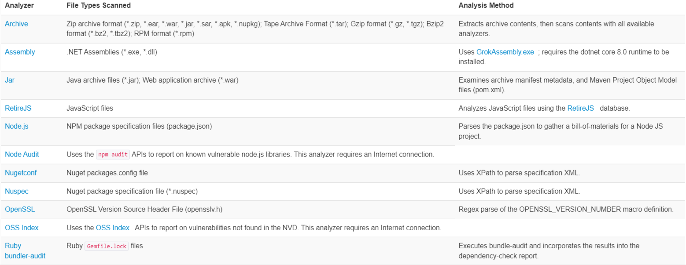
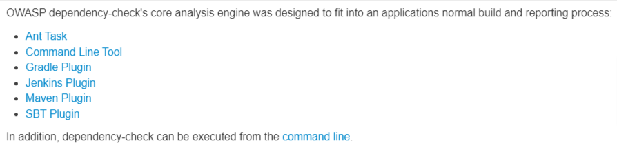
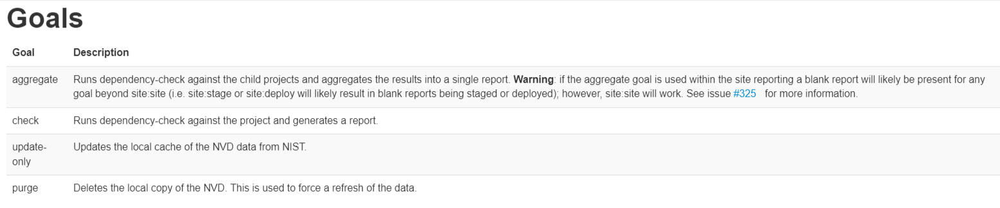
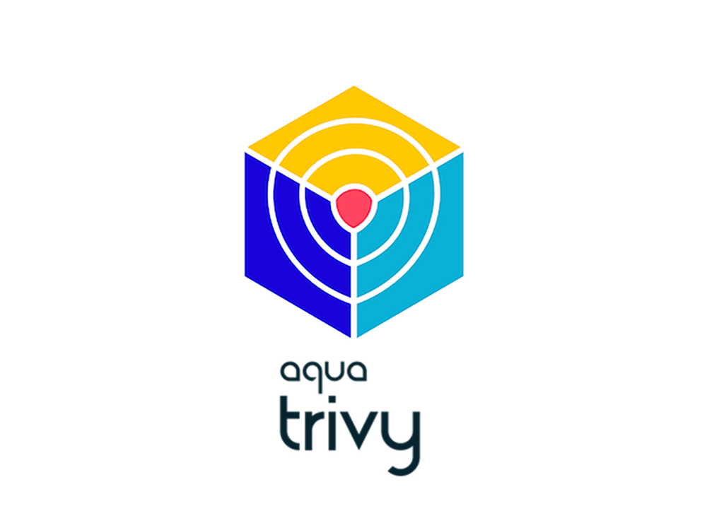

<!-- footer : https://github.com/bartosz-koziak/owasp-sonarqube-trivy -->


---

# CVE-2021-44228: Log4Shell (Apache Log4j 2)

Date: December 2021

Description: A critical **remote code execution (RCE)** vulnerability in Apache Log4j 2's JNDI lookup feature. Attackers can exploit it by sending a specially crafted request to trigger a JNDI lookup.
Impact: Allows unauthenticated remote code execution.

Severity: 10.0 (Critical)

---

# CVE-2017-5638: Apache Struts2 REST Plugin RCE

Date: March 2017

Description: A vulnerability in the Jakarta Multipart parser used by the Apache Struts2 framework. Attackers can **execute arbitrary commands** via a malicious Content-Type header.

Impact: Remote code execution.

Severity: 10.0 (Critical)

---

# CVE-2014-0160: Heartbleed

Date: April 2014

Description: A critical vulnerability in OpenSSL's implementation of the TLS/DTLS heartbeat extension. It allows attackers to read up to 64KB of memory from affected servers, potentially exposing sensitive data such as private keys, usernames, and passwords.

Impact:
- Data Leakage: Exposure of private keys, usernames, passwords, session tokens, and other sensitive information.
- Compromise of Confidentiality: Potential for intercepting sensitive data and further attacks.
- Widespread Affected Systems

Severity: Medium (5.0) per NVD, but practically critical due to data exposure and widespread use.

---

# Jakub Pustelnik

# Bartosz Koziak

## OWASP dependency check, sonar qube, trivy

## Jenkins advanced

---

<!--footer: https://owasp.org/www-project-dependency-check/-->

# Introduction to OWASP dependency check

> OWASP dependency-check is an open source solution to the OWASP Top 10 2021 entry: A06:2021 – Vulnerable and Outdated
> Components. Dependency-check can currently be used to scan software to identify the use of known vulnerable
> components.


---
<!--footer: https://jeremylong.github.io/DependencyCheck/general/internals.html# -->

# How it works

> Dependency-check works by collecting information about the files it scans (using Analyzers). The information collected
> is called Evidence; there are three types of evidence collected: vendor, product, and version

---

<!--footer: https://jeremylong.github.io/DependencyCheck/analyzers/index.html-->

## File type analyzers



---
<!-- footer:https://jeremylong.github.io/DependencyCheck/data/cacheh2.html\nhttps://jeremylong.github.io/DependencyCheck/data/database.html -->

## National Vulnerability Database (NVD)

> [https://nvd.nist.gov](https://nvd.nist.gov)

Contains a listing of Common Vulnerability and Exposures (CVE)

Each CVE entry contains:

- A description of the vulnerability or exposure
- A Common Vulnerability Scoring System (CVSS) score
- A list of affected platforms identified by their Common Platform Enumeration (CPE)
  > cpe:/[Entry Type]:[Vendor]:[Product]:[Version]:[Revision]:…

NVD is **SLOW**!!!

- https://nvd.nist.gov/developers/request-an-api-key
- NVD cache
- Central database

<br />

---

## Manually fill the cache

Extract zip file from `training-app/nvd-cache/dependency-check-data.zip` to
`~/.m2/repository/org/owasp/dependency-check-data/`. Resulting file structure inside the directory should be as below:

```
~/.m/r/o/o/dependency-check-data >> tree -L 2 .
.
├── 7.0
│   ├── cache
│   └── odc.mv.db
└── 9.0
    ├── cache
    ├── jsrepository.json
    ├── odc.mv.db
    ├── odc.trace.db
    ├── oss_cache
    └── publishedSuppressions.xml

```

---

<!--footer: https://jeremylong.github.io/DependencyCheck/general/suppression.html\nhttps://jeremylong.github.io/DependencyCheck/general/hints.html-->

## False positives and false negatives

> Due to how dependency-check identifies libraries false positives may occur (i.e. a CPE was identified that is
> incorrect). Additionally, false negatives may occur if the library was not identified as a dependency.

---
<!--footer: https://jeremylong.github.io/DependencyCheck/general/suppression.html-->

## Suppressing false positives

```xml
<?xml version="1.0" encoding="UTF-8"?>
<suppressions xmlns="https://jeremylong.github.io/DependencyCheck/dependency-suppression.1.3.xsd">
    <suppress>
        <notes><![CDATA[
        This suppresses a CVE identified by OSS Index using the vulnerability name and packageUrl.
        ]]></notes>
        <packageUrl regex="true">^pkg:maven/org\.eclipse\.jetty/jetty-server@.*$</packageUrl>
        <vulnerabilityName>CVE-2017-7656</vulnerabilityName>
    </suppress>
</suppressions>
```

---
<!-- footer: https://jeremylong.github.io/DependencyCheck/modules.html -->

# Dependency check modules



---

<!--footer: https://jeremylong.github.io/DependencyCheck/dependency-check-maven/index.html -->

# Maven plugin

```xml

<project>
    ...
    <build>
        ...
        <plugins>
            ...
            <plugin>
                <groupId>org.owasp</groupId>
                <artifactId>dependency-check-maven</artifactId>
                <version>10.0.2</version>
                <executions>
                    <execution>
                        <goals>
                            <goal>check</goal>
                        </goals>
                    </execution>
                </executions>
            </plugin>
            ...
        </plugins>
        ...
    </build>
    ...
</project>
```

<br />

---

## Maven plugin goals



---
<!-- footer: "" -->

# Hands on

---

# Exercise #1

Fork repository https://github.com/bartosz-koziak/training-app and create a pipeline which:

1. Builds (including tests) the application
2. Runs dependency check maven plugin, make sure report is generated
3. Fails build if there's a vulnerability with CVSS score higher than 7
4. Publishes dependency check report
5. *Add support for vulnerability suppressions

---

# Exercise #2

1. Run dependency check using jenkins plugin https://plugins.jenkins.io/dependency-check-jenkins-plugin/

---

# Introduction to Sonar Qube

> SonarQube is a self-managed, automatic code review tool that systematically helps you deliver Clean Code. As a core
> element of our Sonar solution, SonarQube integrates into your existing workflow and detects issues in your code to
> help
> you perform continuous code inspections of your projects. The product analyses 30+ different programming languages and
> integrates into your Continuous Integration (CI) pipeline of DevOps platforms to ensure that your code meets
> high-quality standards.


---

# Local setup

```docker run -d --name sonarqube -e SONAR_ES_BOOTSTRAP_CHECKS_DISABLE=true -p 9000:9000 sonarqube:9.9-community```

---

# Live demo

---

# Exercise #1

1. Install [Dependency check sonar plugin](https://github.com/dependency-check/dependency-check-sonar-plugin) in sonar qube
2. Setup sonar plugin in maven
  ```xml
  
  <plugin>
      <groupId>org.sonarsource.scanner.maven</groupId>
      <artifactId>sonar-maven-plugin</artifactId>
      <version>4.0.0.4121</version>
  </plugin>
  ```
3. Publish dependency check report to sonar qube

---
<!-- footer: https://aquasecurity.github.io/trivy/v0.53/ -->

# Introduction to Trivy

> Trivy is a comprehensive and versatile security scanner. Trivy has scanners that look for security issues, and targets where it can find those issues.



---
<!-- https://aquasecurity.github.io/trivy/v0.53/getting-started/installation/#use-container-image -->

# Running trivy as container

```bash
docker run -v /var/run/docker.sock:/var/run/docker.sock -v $HOME/Library/Caches:/root/.cache/ aquasec/trivy:0.53.0 image $(training-app-image)
```

Initial execution takes quite long due to the fact that trivy needs to download the database.

---
<!-- footer: https://aquasecurity.github.io/trivy/v0.53/docs/ -->

# Supported targets

_(what Trivy can scan)_

- Container Image
- Filesystem
- Git Repository (remote)
- Virtual Machine Image
- Kubernetes
- AWS

---

# Available scanners

_(what Trivy can find in targets)_

- OS packages and software dependencies in use (SBOM)
- Known vulnerabilities (CVEs)
- IaC issues and misconfigurations
- Sensitive information and secrets
- Software licenses

---
<!-- footer: https://aquasecurity.github.io/trivy/v0.53/docs/configuration/reporting/ -->

# Reporting

Trivy supports the following formats:

- Table
- JSON
- SARIF
- Template
  - JUnit
  - ASFF
  - HTML
- SBOM
- GitHub dependency snapshot

Also outputs by plugins are supported (e.g. sonar qube compatible format)

---

# Configuration

Via:
- CLI flags
- Environment variables
- Configuration file

---

## Environment variables

Trivy can be customized by environment variables. The environment variable key is the flag name converted by the following procedure.

- Add TRIVY_ prefix
- Make it all uppercase
- Replace - with _

For example,

```
--debug => TRIVY_DEBUG
--cache-dir => TRIVY_CACHE_DIR
```

---

## Suppressions

<!-- footer: https://aquasecurity.github.io/trivy/v0.53/docs/configuration/filtering/#suppression--> 

Can be configured by providing .trivyignore file

For example,
```bash
$ cat .trivyignore
# Accept the risk
CVE-2018-14618

# Accept the risk until 2023-01-01
CVE-2019-14697 exp:2023-01-01

# No impact in our settings
CVE-2019-1543

# Ignore misconfigurations
AVD-DS-0002

# Ignore secrets
generic-unwanted-rule
aws-account-id
```

<br />

---

<!-- footer: ""--> 

# Exercise #1

1. Run trivy on the training-app image
2. Generate html report
3. Publish it as pipeline artifact

[//]: # (
docker run -v /var/run/docker.sock:/var/run/docker.sock -v $HOME/Library/Caches:/root/.cache/ aquasec/trivy:0.53.0 image --format template --template "@contrib/html.tpl" -o /root/.cache/report.html sha256:b7f5f9c69b24c1d4f95d6fff58c1fb614dc9676dd731f1ee7287d84eed1a523c
)

---
# Exercise #2

Publish trivy report to sonar qube using https://github.com/umax/trivy-plugin-sonarqube

_Running sonarqube plugin requires python3 - you'll have to build your own image based on default trivy image_

[//]: # (
docker run -v /var/run/docker.sock:/var/run/docker.sock -v $HOME/Library/Caches:/root/.cache/ -v $HOME/Library/Plugins:/root/.trivy/plugins aquasec/trivy:0.53.0 plugin install github.com/umax/trivy-plugin-sonarqube
docker run -v /var/run/docker.sock:/var/run/docker.sock -v $HOME/Library/Caches:/root/.cache/ -v $HOME/Library/Plugins:/root/.trivy/plugins aquasec/trivy:0.53.0 image --format=json -o /root/.cache/report.json sha256:b7f5f9c69b24c1d4f95d6fff58c1fb614dc9676dd731f1ee7287d84eed1a523c
)

---